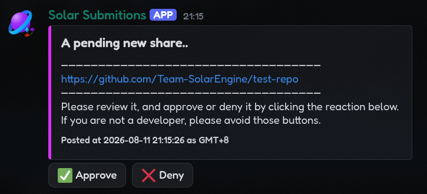

# Solar Pending Shares
This just sends a embed for the [shared section in the solar website](https://solarengine.net/shares). Here's a preview.



## Setting up
- Install Python latest.
- Have a 24/7 server running at all times.
- A Discord bot account. DON'T FUCKING USE A NON-BOT ACCOUNT.
- Have git (obvious...)

```bash
# clone the repo repo repo
git clone https://github.com/Team-SolarEngine/solar-pending-shares
cd solar-pending-shares

# create token.txt beforehand dummy
echo "INPUT_DISCORD_TOKEN_FOR_YOUR_CLANKER" > token.txt
# don't leave this as `INPUT_DISCORD_TOKEN_FOR_YOUR_CLANKER` - replace it with your actual token
# also don't share or commit this file YOU WILL BE PWNED DUMMY!!

# do all python shit ig
python -m venv venv
venv/bin/pip install -r requirements.txt
venv/bin/python src/main.py
```

## CHECK THE FILES.
Inside of [`@src/nextcord_calls.py`](./src/nextcord_calls.py), please update `lists_of_approved_people` and `CHANNEL_ID` to your own values. Make sure you have developer mode enabled in Discord to get the channel ID.

## Usage
Run `venv/bin/python src/main.py` to start the REST API and Bot. (obvious lmao)

To send requests, use the `POST /send_shares` endpoint with the appropriate JSON payload.

### Examples
**Bash**
```bash
curl -X POST http://127.0.0.1:8000/send_shares -H 'Content-Type: application/json' -d '{"url":"https://github.com/Team-SolarEngine/test-repo"}'
```

**JavaScript**
```javascript
function sendShares(url) {
  fetch('http://127.0.0.1:8000/send_shares', {
    method: 'POST',
    headers: {
      'Content-Type': 'application/json',
    },
    body: JSON.stringify({ "url": url }),
  })
  .then(response => response.json())
  .then(data => console.log(data))
  .catch(error => console.error(error));
}
```
> [!NOTE]
> For TypeScript, just add `: string` to the `url` parameter. That's it!

> [!TIP]
> If you are actually using this for production, replace `http://127.0.0.1:8000` with your actual server URL.